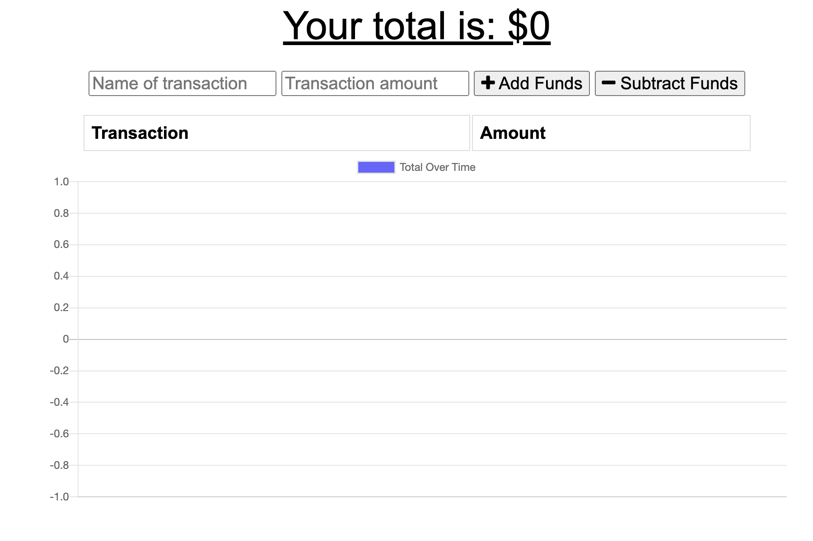
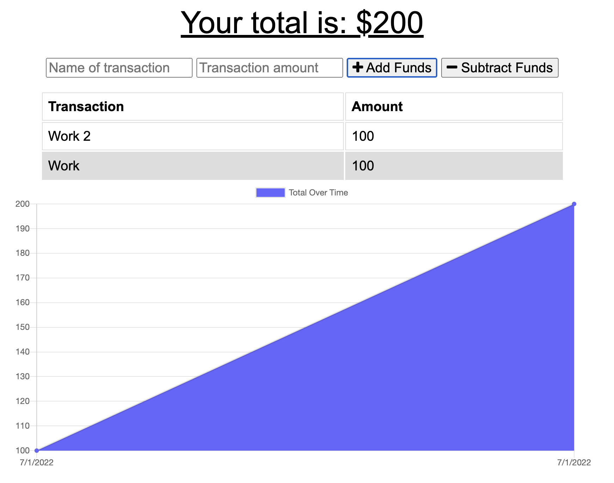
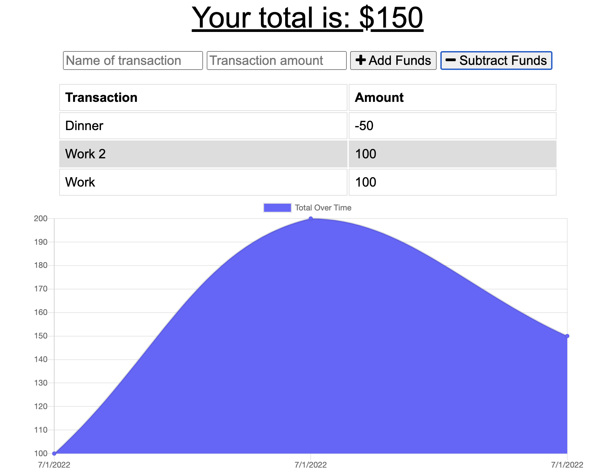

# Budget Tracker

  

## <u>Table of Contents</u>
1. [Description](#description)
2. [Installation](#installation)
3. [Usage](#usage)
4. [Contributing](#contributing)
5. [Questions](#questions)
6. [License](#license)

## Description
***

Budget Tracker is a progressive web application (PWA) that allows users to track their money by adding withdrawals and deposits. It includes a log of transactions and a graph to visualize your saving/spendings.

Budget Tracker has the capability to work online and offline, utilizing service workers and indexedDB to perform the offline functionality and the ability to re-establish connection when online capability is returned. Budget Tracker is deployed on Heroku via MondoDB Atlas and can also be installed on your local device similar to a native application. 

## Installation
***

To install this application, visit the Heroku link and the option to install the application is given in the URL, both on desktop and on a mobile phone.

## Usage
***

To use this application, input the name of the transaction and the amount of the transaction, and chose either to add funds of subtract funds. This can be performed with/without an established WiFi connection.

The following images show the application being used: 

 

***

***

***

The following is a link to the deployed application: [Budget Tracker](https://murmuring-harbor-62394.herokuapp.com/) 

## Contributing
***

To contribute to this application, push any enhancements and changes you code and send an email to charanvir123@gmail.com. The developer will get back to you if they wish to implement any of the code changes you've made. 

## Questions
***
To view more projects visit my [Github](https://github.com/Charanvir) account.

Direct any additional questions you have regarding this application to charanvir123@gmail.com

## License
***
The following application is covered under the MIT License
